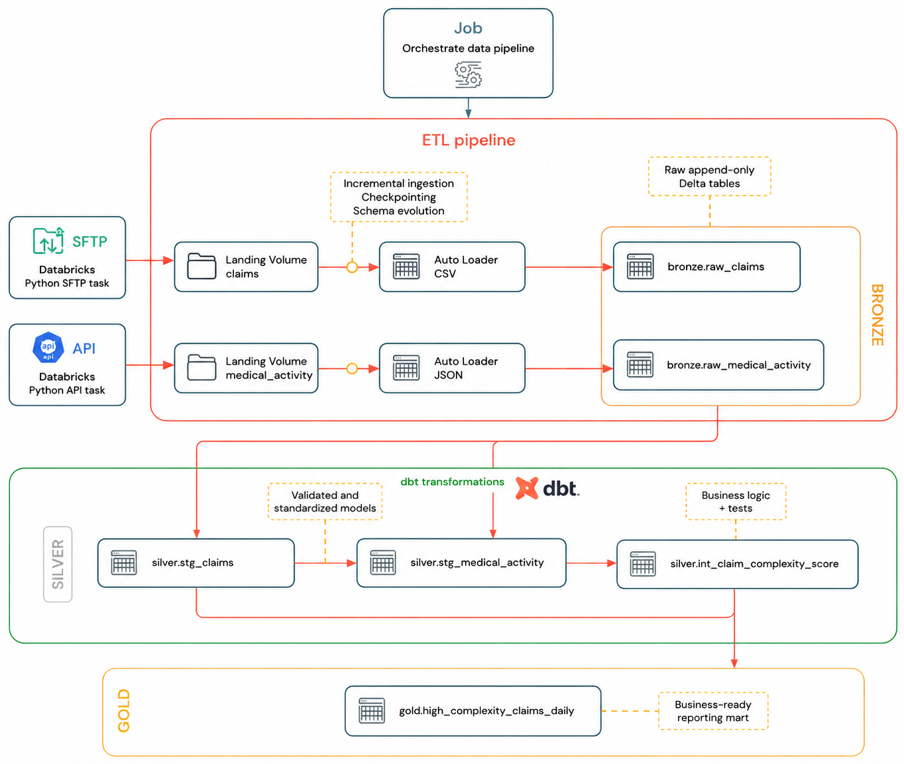

# Claims Complexity Pipeline

This project demonstrates a production-oriented Databricks + dbt pipeline
for ingesting and analyzing insurance claims data from SFTP CSV files
and API-delivered JSON medical activity data.

## Architecture

